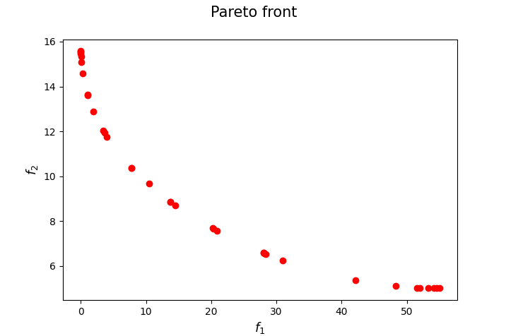
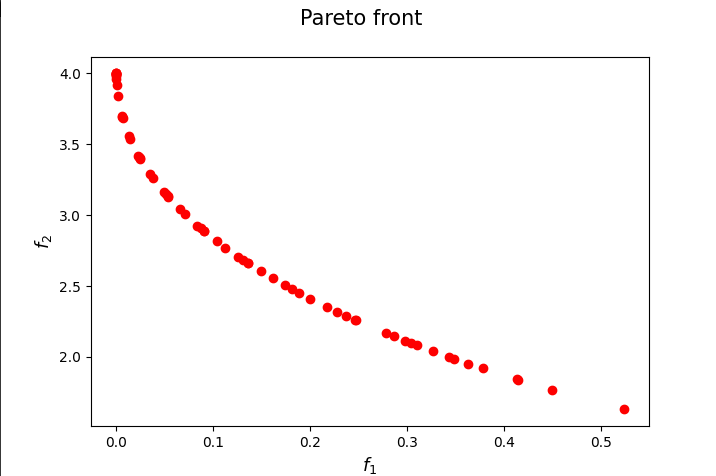

[](https://www.python.org/downloads/release/python-3106/)
[](https://opensource.org/licenses/Apache-2.0)
[](https://zenodo.org/badge/latestdoi/596107659)

<p>
  
   
</p>

## IFSD: Improved Front Steepest Descent for Multi-Objective Optimization

Implementation of the IFSD Algorithm proposed in

[Lapucci, M. & Mansueto, P., Improved Front Steepest Descent for Multi-objective Optimization. arXiv pre-print (2023).](
https://doi.org/10.48550/ARXIV.2301.03310)

If you have used our code for research purposes, please cite the publication mentioned above.
For the sake of simplicity, we provide the Bibtex format:

```
@misc{ifsd2023,
  doi = {10.48550/ARXIV.2301.03310},
  url = {https://arxiv.org/abs/2301.03310},
  author = {Lapucci, Matteo and Mansueto, Pierluigi},
  keywords = {Optimization and Control (math.OC), FOS: Mathematics, FOS: Mathematics, 90C29 90C30}, 
  title = {Improved Front Steepest Descent for Multi-objective Optimization},
  publisher = {arXiv}, 
  year = {2023},
  copyright = {arXiv.org perpetual, non-exclusive license}
}

```

### Main Dependencies Installation

In order to execute the code, you need an [Anaconda](https://www.anaconda.com/) environment and the Python package [nsma](https://pypi.org/project/nsma/) installed in it. For a detailed documentation of this framework, we refer the reader to its [GitHub repository](https://github.com/pierlumanzu/nsma).

For the package installation, open a terminal (Anaconda Prompt for Windows users) in the project root folder and execute the following command. Note that a Python version 3.10.6 or higher is required.

```
pip install nsma
```

##### Gurobi Optimizer

In order to run some parts of the code, the [Gurobi](https://www.gurobi.com/) Optimizer needs to be installed and, in addition, a valid Gurobi licence is required.

### Usage

In ```parser_management.py``` you can find all the possible arguments. Given a terminal (Anaconda Prompt for Windows users), an example of execution could be the following.

```python main.py --algs IFSD --probs MAN --max_time 2 --plot_pareto_front --plot_pareto_solutions --general_export --export_pareto_solutions```

### Contact

If you have any question, feel free to contact me:

[Pierluigi Mansueto](https://webgol.dinfo.unifi.it/pierluigi-mansueto/)<br>
Global Optimization Laboratory ([GOL](https://webgol.dinfo.unifi.it/))<br>
University of Florence<br>
Email: pierluigi dot mansueto at unifi dot it
